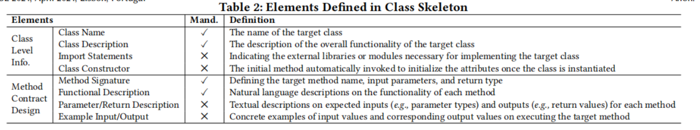

## More Details in Benchmark Construction

#### preliminary exploration

The process of benchmark construction can be segmented into two primary phases: the preliminary exploration and the mass construction phase following the foundational establishment of class skeletons and their accompanying design principles. Due to space constraints, our paper mainly illustrates the procedures involved in the mass construction phase. However, the selection of class features included in the class-level generation tasks, along with the formulation of the class skeleton design, was predominantly accomplished during the preliminary exploration phase. Specifically, we conducted a small-scale exploration of class-level generation sample tasks  with different class features, in order to gain a preliminary understanding of the performance of LLMs on class-level generation tasks of varying difficulty. Furthermore, we iteratively experimented with different class skeleton designs to ensure that LLM could better understand our class-level code generation tasks.

#### Challenges in benchmark construction

Throughout the whole construction process, we primarily faced two challenges: (1) balancing the complexity of tasks to reflect real-world software engineering intricacies at the class level without making the benchmark too complex to exceed the model’s capabilities , and (2) ensuring the precision of task descriptions provided to the models, which is vital to avoid scenarios where the model generates code that technically meets the description but fails test cases, leading to misleading evaluation metrics. 

For the first challenge, we assess current LLMs performance on class-level generation tasks, incorporating various class features, in the preliminary exploration. From the observation, we found that except for advanced models like GPT-3.5 and GPT-4, most struggled to produce compilable code with tasks requiring the generation of multiple classes with features such as inheritance and polymorphism. Besides, these class features led to highly flexible code outputs that were difficult to test. Consequently, we shifted our focus on classes that compound code units comprising multiple methods and class constructors to emphasize different class-level contextual dependencies. Furthermore, during the task selection phase, we drew inspiration from various sources, prioritizing the design of relatively independent class-level tasks that could be extended into various interdependent methods. Please refer to C4 for more detailed explanations that how we select tasks to address this challenge.

To address the second challenge, we meticulously designed class skeletons grounded in the principles of contract programming. Specifically, from the observation in preliminary exploration, providing only class-level natural language descriptions and method signatures could result in overly flexible code outputs from the models, complicating accurate testing. Additionally, excessively detailed natural language descriptions could hinder model comprehension. Hence, we settled on class skeletons that include both class-level information and method contract designs. Following table shows the elements defined in Class Skeleton.

 During the class skeleton construction phase, as more instances emerged, coupled with discussions to reconcile differences and feedback from subsequent test construction and canonical solution construction phases, we continuously refined our class skeleton design principles, ensuring the accuracy and testability of the class skeletons, solidifying the robustness of our evaluation approach.
